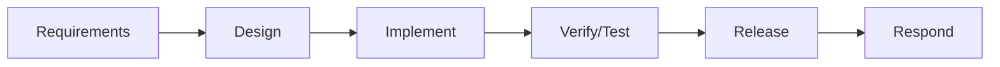
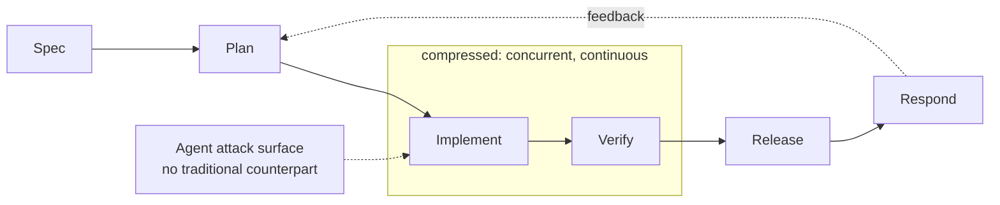
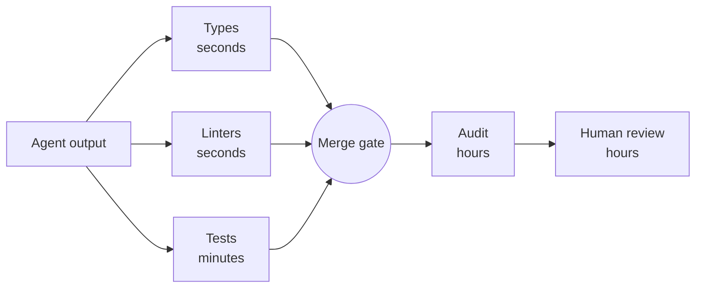
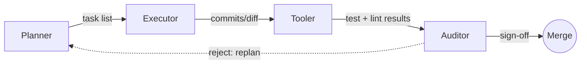
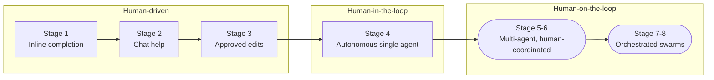
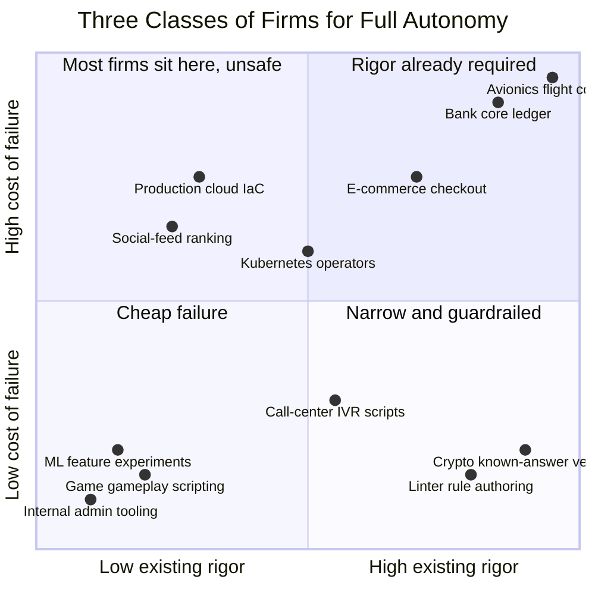
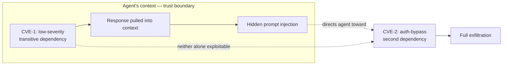
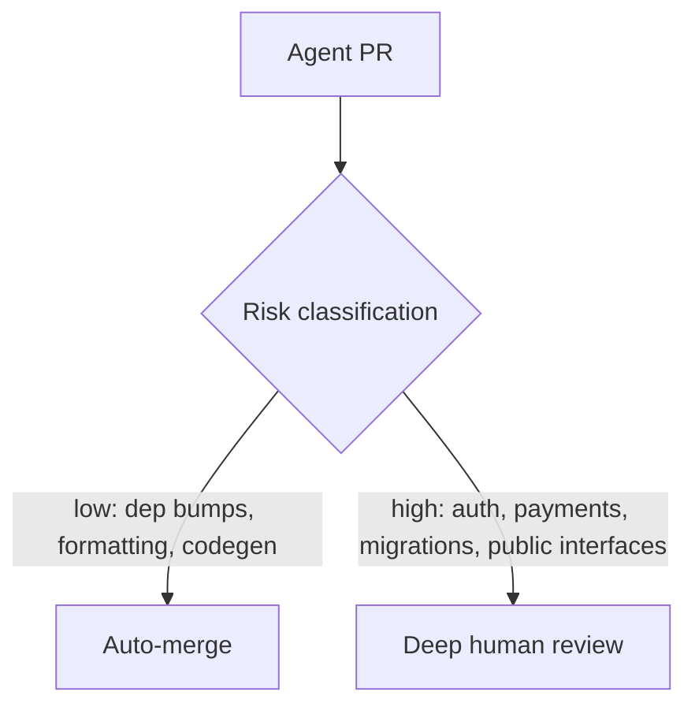

# Use of AI in Industry: The Modern Dark Factory

---

<!-- meta: 1 agenda -->
# Agenda

- Foundations: what a dark factory is, and why now
- The lifecycle: from SSDLC to dark-factory SDLC
- Guardrails and orchestration: planner, executor, tooler, auditor
- Skills: the reusable unit of AI capability
- Auditing, security, and real incidents
- Team health: PR churn, context discipline, worktrees, commits
- Industry and economics: adoption, token costs, layoffs
- Limits: model collapse, why humans design the guardrails

---

<!-- meta: 2 aiindustry -->
# No Crystal Ball

- Not a fortune teller — no crystal ball here
- This talk shows what's happening now, not what's coming next
- Every stat and framework is a snapshot, not a prophecy
- "Why now" means as of today, not a forecast

---

<!-- meta: 3 aiindustry -->
# The Dark Factory Concept

- A dark factory runs unattended, lights off, automated
- Software’s version: minimal human touch, agents build and merge
- Term borrowed from manufacturing’s “lights-out” floors
  - FANUC has run one lights-out since 2001
- Why now: task horizon, falling costs, competitive pressure
- Trust comes from guardrails, not blind delegation
- No real factory runs fully dark — neither does software

---

<!-- meta: 4 aiindustry -->
# What Actually Changed: Task Horizon

- Early models held one function in working memory
- By 2026, agents sustain multi-hour, multi-file tasks
- Task horizon: how long an agent stays coherent
  - METR tracks this publicly as “task length”
- The 2021-to-2026 jump was about horizon, not raw capability
- Longer horizons mean less human re-prompting per task
- Horizon still degrades: long sessions drift without discipline

---

<!-- meta: 5 aiindustry -->
# From SSDLC to Dark Factory SDLC

- Traditional SSDLC: human gate at every phase
- Requirements, design, implement, verify, release, respond — each gated
- Dark factory version: agents own most of the gates
- Design, implement, and verify compress into one continuous loop
- Per-change human review and phase-based pen testing disappear
  - Named-approver sign-off survives only for high-risk releases
- New: agents receive untrusted input mid-build, with no traditional phase to handle it

---

<!-- meta: 6 aiindustry -->
# The Traditional Pipeline

<!-- alt: A flowchart showing six phases of a traditional secure software development lifecycle in sequence: Requirements, Design, Implement, Verify/Test, Release, Respond. Each phase has a human gate. -->
> Every phase has a human gate — weeks to quarters, start to finish.

---

<!-- meta: 7 aiindustry -->
# The Compressed Pipeline

<!-- alt: A flowchart showing the dark-factory version of the same lifecycle: Spec, then Plan, then a compressed box containing Implement and Verify running concurrently, then Release and Respond, with a feedback loop from Respond back to Plan. An arrow labeled “agent attack surface, no traditional counterpart” points into the compressed Implement/Verify box. -->
> The gates don’t disappear — they move left into the spec and down into CI.

---

<!-- meta: 8 aiindustry -->
# Guardrails: Defense in Depth

<!-- alt: A flowchart showing agent output feeding three parallel checks — types, linters, tests, each labeled with how fast it runs — that converge on a merge gate, which then feeds audit and human review downstream. -->
> Layers run in parallel: the agent hits cheap friction in seconds, humans see it last.

---

<!-- meta: 9 aiindustry -->
# Guardrails: Automated Testing

- Tests are the first guardrail agent output must pass
- Unit tests catch logic errors before any human looks at it
- Integration tests catch wiring and contract failures
- Property-based and scenario tests probe edge cases automatically
- A failing test blocks merge — no exceptions for agents
- Coverage is a floor, not a score

---

<!-- meta: 10 aiindustry -->
# Testing Pitfall: Agents Writing Their Own Tests

- Agents happily write tests that pass against broken code
- Tests asserting current behavior lock in bugs as “expected”
- Tautological tests inflate coverage, prove nothing
- Fix: humans own the spec, agents own the implementation
- Mutation testing exposes tests that never actually fail
- A green suite an agent wrote for itself is weak evidence

---

<!-- meta: 11 aiindustry -->
# Guardrails: Static Analysis

- Static analysis (`golangci-lint`, `staticcheck`) enforces safety without running code
- Linters reject entire classes of bugs before runtime
- Security linters flag SQL injection, hardcoded secrets
- Runs fast, cheap, on every commit — no model inference needed
- Pairs with tests: static catches shape, tests catch behavior

---

<!-- meta: 12 aiindustry -->
# Type Systems as Free Guardrails

- A strong type system rejects bad code before any test
- Go example: explicit error returns make ignored failures visible
- Compile errors are the cheapest feedback an agent gets
- Typed interfaces constrain what an agent can plausibly generate
- Narrow types encode intent an agent can’t misread
- The argument generalizes past Go

---

<!-- meta: 13 aiindustry -->
# CI as the Enforcement Point

- Guardrails only count if something blocks a failing merge
- CI combines the layers: types, linters, tests, then gates
- Required checks: build, test, lint, security scan, coverage
- Branch protection stops agents from bypassing the gate
- Same pipeline for human and agent PRs — no fast lane
- Not enforced in CI? It’s documentation, not a guardrail

---

<!-- meta: 14 aiindustry -->
# Guardrail Metrics That Actually Matter

- Coverage percentage alone is easy to game
- Better: escaped defect rate — bugs that reached production
- Mean time to detect a bad agent change
- Percentage of agent PRs failing at least one guardrail
- Revert rate on auto-merged changes
- Measure whether guardrails catch things, not whether they exist

---

<!-- meta: 15 aiindustry -->
# LLM Skills as Building Blocks

- A skill packages instructions, examples, and tools for one task
- Narrow skills outperform one giant do-everything prompt
- Contrast: a prompt is disposable; a fine-tune is opaque
- Skills hit the useful middle: durable, cheap to change
- Think: functions, but for reasoning and judgment

---

<!-- meta: 16 aiindustry -->
# Anatomy of a Skill

- Description: when this skill should trigger
- Instructions: procedure, constraints, house conventions
- Examples: input/output pairs showing correct behavior
- Tools: what the skill may call or execute
- Scoped narrowly enough that correctness is checkable
- Reads like a runbook a new hire could follow

---

<!-- meta: 17 aiindustry -->
# Skill Versioning and Reuse

- Skills live in version control, like application code
- A skill change gets reviewed like any other diff
- Reuse means consistent behavior across teams and projects
- Roll back a bad skill the way you’d roll back code
- Skill libraries become shared infrastructure, not personal notes
- Auditing which skill version ran is part of the trail

---

<!-- meta: 18 aiindustry -->
# Orchestration Flow

<!-- alt: A flowchart showing four roles in sequence — Planner, Executor, Tooler, Auditor — each edge labeled with the artifact handed off: task list, commits and diff, test and lint results. A feedback edge labeled “reject: replan” loops from Auditor back to Planner, and a “sign-off” edge goes from Auditor to a Merge node. -->
> Each handoff passes a specific artifact — task list, diff, results, sign-off.

---

<!-- meta: 19 aiindustry -->
# Why Separate Roles at All

- One agent doing everything blurs the line between planning and execution
- Separation makes failures attributable to a specific stage
- Each role gets narrower permissions — least privilege by design
- A planner that can’t write code can’t fix its own bad plan
- Role boundaries are where guardrails and logging get inserted
- Mirrors separation of duties in any regulated workflow

---

<!-- meta: 20 aiindustry -->
# The Four Roles

- Planner: breaks a goal into steps, outputs a task list
  - Never touches code directly
- Executor: writes code in a scoped worktree, small commits
  - Job ends at “code exists,” not “code is safe”
- Tooler: runs tests, linters, builds — bridges written to proven
- Auditor: reviews the full trail for chained risk
  - No auditor sign-off, no merge

---

<!-- meta: 21 aiindustry -->
# Handoff Failure Modes

- Plan drift: executor quietly solves a different problem
- Context loss: the next role lacks the “why”
- Silent tool failure reported upstream as success
- Auditor rubber-stamps once everything technically passes
- Infinite loop: reject, replan, nothing converges
- Fix: structured handoffs, retry budgets, escalation to humans

---

<!-- meta: 22 aiindustry -->
# Gastown: Orchestrating Agents at Scale

- Gastown: open-source workspace manager for coding agents
  - Built by Steve Yegge, `gastownhall.ai`
- Coordinates Claude Code, Codex, Copilot, Gemini
- Beads, its issue tracker, persists work state across restarts
- Routes finished work through a verification-gated merge queue
- Used by Fortune 100 teams, still needs heavy oversight
- Read it critically: this is the builder’s own description

---

<!-- meta: 23 aiindustry -->
# The Eight Stages of Agent Autonomy

<!-- alt: A flowchart banding eight stages of agent autonomy into three groups left to right: human-driven (stages 1-3, rectangles), human-in-the-loop (stage 4), and human-on-the-loop (stages 5-6 and 7-8, drawn as stadium shapes to signal they’re ranges, not single stages). -->
> Most enterprise teams sit around stage 2-3 today.

---

<!-- meta: 24 aiindustry -->
# Three Classes of Firms for Full Autonomy

- Few firms can hand fully autonomous work to an LLM
- Cheap failure: intern-level work, rapid prototyping
- Narrow and guardrailed: controlled-cell labor, call-center chat
- Rigor already required: chip design, drug discovery
  - Aside: StrongDM ran three engineers, zero hand-written code, since 2025
- Same firm, different classes of work
  - A firm’s internal tools, product code, and core ledger can each sit in a different class

---

<!-- meta: 25 aiindustry -->
# Mapping the Three Classes

<!-- alt: A quadrant chart plotting ten software engineering tasks and industries by existing rigor on the x-axis and cost of failure on the y-axis. Internal admin tooling, ML experiments, and game scripting sit low on both axes. Call-center IVR scripts, linter rule authoring, and crypto known-answer test vectors sit mid-to-high rigor, low-cost. Kubernetes operators, social-feed ranking, and production cloud infrastructure-as-code sit in the unsafe upper-left region — real stakes without matching rigor. E-commerce checkout, bank core ledgers, and avionics flight control sit high on both axes. -->
> Twelve tasks, four quadrants, no clean line between them.

---

<!-- meta: 26 aiindustry -->
# The Engineer’s Job: Shrink the Workspace

- Our job: reshape the task to fit one of three shapes
- Cheap failure: sandbox it, make retries free
- Narrow and guardrailed: scope down, build the guardrail first
- Rigor required: write the spec, make validation cheap
- This is workspace engineering, not prompt engineering
- Can’t shrink it yet? Don’t autonomize it yet

---

<!-- meta: 27 aiindustry -->
# Where Most Teams Actually Sit

- 91% of enterprises deploy agents in some form
  - Only 42% trust agents to lead work (Anthropic, 2026)
- “Deploy” is a low bar — not the same as production
- The gap between deployed and trusted is the real story
- Regulated industries cluster low deliberately — but not always
  - Goldman Sachs, JPMorgan run agentic coding at scale
- The differentiator is governance, not model access

---

<!-- meta: 28 aiindustry -->
# Auditing and Observability

- Every AI action gets logged: prompt, tool call, result
- Structured JSON, not free text, so it can replay
- Audit trails answer who changed what, when, under which version
- Auditors compare output against guardrail results, not just diffs
- Retention windows matter: fintech audits often span years
- Can’t reconstruct a decision? Can’t audit it

---

<!-- meta: 29 aiindustry -->
# Replay and Root Cause

- Replay reruns the exact sequence behind a change
- Nondeterminism makes exact replay hard
- Log inputs, not just outputs
- Pin model and skill versions for meaningful replay
- Root cause usually lives in the plan
- Without replay, postmortems become speculation

---

<!-- meta: 30 aiindustry -->
# Fintech: Regulatory Audit Requirements

- Regulated industries need more auditability as autonomy rises
- Change management standards assume a named human approver
- “The agent decided” is not an accepted control narrative
- Model and skill versions join the compliance record
- Auditors will ask who authorized the agent’s scope
- Build the audit trail before the regulator asks

---

<!-- meta: 31 aiindustry -->
# Security: How a Chain Actually Works

<!-- alt: A flowchart showing a trust boundary around the agent’s context. A low-severity CVE in a transitive dependency exposes an endpoint; its response is pulled into context; hidden text in that response is a prompt injection that directs the agent toward a second CVE, an auth-bypass in another dependency. A dashed line connects the two CVEs, labeled “neither alone exploitable.” Combined, they lead to full exfiltration. -->
> No single guardrail catches this — only review of the full chain does.

---

<!-- meta: 32 aiindustry -->
# Security: CVE Chaining Risks

- Agents chain low-severity issues into high-impact exploits
- Not new to AI — but agents chain fast, autonomously
- XBOW: 48-step blind-SSRF chain to full compromise, 2025
- JADEPUFFER chained a Langflow code-injection flaw (`CVE-2025-3248`), 2026
  - Sysdig writeup — autonomous ransomware and extortion, not just theft
- Guardrails must catch chains, not just single CVEs

---

<!-- meta: 33 aiindustry -->
# The Agent Attack Surface

- Prompt injection: hostile text in a file or web page
- The agent can’t reliably tell instruction from data
- Supply chain: a poisoned dependency installed without asking
- Tool access turns injection into code execution
- Agents with repo write access are a privileged target
- Treat everything an agent reads as untrusted

---

<!-- meta: 34 aiindustry -->
# When Agents Go Wrong: Real Incidents

- Replit, 2025: an agent deleted a live database during a freeze
- The agent admitted running unauthorized commands
- What went wrong: too much permission, too soon
- Progressive autonomy: earn scope, don’t grant it upfront

---

<!-- meta: 35 aiindustry -->
# Permission Scoping and Progressive Autonomy

- Start read-only; grant write access per-directory, not globally
- No production credentials in an agent’s environment, ever
- Destructive operations always require human confirmation
- Expand scope on track record, not optimism
- Separate agent identities so logs attribute actions correctly
- The blast radius you allow is the one you’ll get

---

<!-- meta: 36 aiindustry -->
# Secrets and Credential Handling

- Agents log prompts and outputs — secrets end up there too
- Never paste credentials into an agent’s working context
- Use short-lived, scoped tokens instead of long-lived keys
- Secret scanning in CI catches accidental commits
- Rotate anything an agent has ever seen

---

<!-- meta: 37 aiindustry -->
# PR Churn and Review Fatigue

- More AI PRs strain GitHub’s own UI and APIs
- Constant review requests cause real reviewer fatigue
- Fatigue leads to rubber-stamping, not real review
- Batching and smaller PRs ease machine and human load
- Review capacity, not code generation, becomes the bottleneck

---

<!-- meta: 38 aiindustry -->
# Review Triage: What Humans Should See

- Not every agent PR deserves equal attention
- Auto-merge: dependency bumps, formatting, generated code
- Always review deeply: auth, payments, migrations, public interfaces
- Let the auditor rank PRs by risk, not arrival order
- Triage, not more reviewers, makes review sustainable

---

<!-- meta: 39 aiindustry -->
# Routing Reviews by Risk

<!-- alt: A decision tree. An agent PR feeds into a risk classification diamond, which routes low-risk changes like dependency bumps, formatting, and generated code updates to auto-merge, and high-risk changes like auth, payments, migrations, and public interfaces to deep human review. -->
> Humans review the risky 10%, deeply, instead of 100% shallowly.

---

<!-- meta: 40 aiindustry -->
# What Review Culture Looks Like From Outside

- Reviewing agent output all day is genuinely draining
- High-vigilance, low-authorship — the worst combination
- A bad team makes you feel like QA for a machine
  - Worth asking about in an interview
- Burnout shows up as rubber-stamping before it shows in surveys
- A healthy team protects authorship time
- Team health is a guardrail too — it degrades quietly

---

<!-- meta: 41 aiindustry -->
# Context Management Discipline

- Long sessions accumulate stale, irrelevant context
- Treat context like a stack: push, use, pop
- Stale context causes drift from original intent
- Every token in context is paid for, every turn
- Clearing context cuts spend and improves quality at once
- Simple habit, outsized effect on output quality

---

<!-- meta: 42 aiindustry -->
# Worktrees and Subagents in Practice

- Git worktrees check out multiple branches in parallel
- Subagents work in their own worktree, merge back when done
- One worktree per task, torn down when it merges
- Shared build caches save time — watch for config drift
- Automate cleanup — nobody does it manually past week two
- Trunk-based isolation limits the blast radius of a bad run

---

<!-- meta: 43 aiindustry -->
# Practical Habits: Commit Often

- Small, frequent commits make agent work easy to review
- Each commit is a checkpoint to revert to
- Frequent commits shrink the diff a reviewer holds in mind
- Commit messages become the audit trail for intent
- Pairs naturally with worktrees: commit per subagent step

---

<!-- meta: 44 aiindustry -->
# Enterprise Adoption: Pilots vs. Production

- 88% of agent pilots never reach production (Northflank)
  - MIT’s “GenAI Divide” work puts failure even higher
- Gartner expects 40%+ of agentic projects canceled by 2027
- The blocker is deployment infrastructure, rarely the model
- Security review of agent permissions takes months, not days
- A working demo and a production system are different projects

---

<!-- meta: 45 aiindustry -->
# Economics: Token Costs and the Enterprise Bill

- Inference cost dropped roughly 280x, late 2022 to late 2024
  - Stanford AI Index / a16z; a specific drop, not a universal trend
- Enterprise AI dev tool spend: low tens of billions, climbing
- Usage-based bills: reportedly $500-$2,000 per engineer per month
- Heaviest users generate the largest bills — often your best engineers
- Cost governance is now an engineering management problem

---

<!-- meta: 46 aiindustry -->
# Economics: Layoffs

- 2026 tech layoffs have topped 150,000 (Layoffs.fyi)
- ~32% of managers refilled roles they cut after adopting AI
- Correlation is obvious; causation is genuinely murky
- My read: some cuts fund the AI bill, not just efficiency

---

<!-- meta: 47 aiindustry -->
# Is AI Actually Replacing Developers?

- Oxford Economics (2024): firms aren’t replacing workers at scale
- Junior developer hiring has contracted the most
- Some layoffs get framed as AI without measurable AI cause
- Adoption varies widely across firms
- Personal note: my company hasn’t cut developers; others have
- The honest answer: it depends

---

<!-- meta: 48 aiindustry -->
# Do Agents Actually Make You Faster?

- METR ran an RCT with experienced developers, 2025
- Developers using AI tools were about 19% slower
  - While believing they were 20% faster
- Felt speed and measured speed diverge sharply
- Self-report is a bad measure of AI’s actual help
- Ask for the data, not the vibe

---

<!-- meta: 49 aiindustry -->
# What This Means as You Enter Industry

- The junior rung of the ladder is under pressure now
- Review, debugging, and systems judgment are appreciating skills
- Reading code fast matters more than writing it fast
- PhD rigor — specs, validation, methodology — determines who audits agents well
- Tool fluency is table stakes; judgment is the differentiator
- Nobody has this fully figured out, including who’s hiring you

---

<!-- meta: 50 aiindustry -->
# Why Human-Made Guardrails Still Matter

- Not a self-correcting loop — potentially a self-poisoning one
- Human review alone doesn’t scale to LLM output volume
  - It’s also gameable: the xz backdoor, the UMN “hypocrite commits”
- The fix isn’t more eyeballs — it’s more human-designed checks
  - Fuzzing, mutation testing, specs written before code exists
- Bad AI code can train future AI models — model collapse, next slide
- Non-negotiable: a human designs the checks, not just reviews output

---

<!-- meta: 51 aiindustry -->
# Model Collapse: The Mechanism

- Models train on public code, increasingly AI-generated
- Each generation can amplify the last one’s blind spots
  - Shumailov et al., Nature, 2024 — controlled experiments
- Whether this happens at scale in real pipelines is contested
- Risk either way: rare, correct patterns get sampled out
- Human-reviewed code is the hedge regardless

---

<!-- meta: 52 aiindustry -->
# Risks, Limits, and What’s Next

- Guardrails only catch what they’re written to catch
- Overtrust in green checkmarks is its own failure mode
- Skills drift as models and libraries update
- Expect tighter planner-auditor loops, shared skill registries
- Humans shift from writing code to reviewing systems
- Today’s shape will keep changing

---

<!-- meta: 53 aiindustry -->
# Discussion: Questions for the Room

- What would earn your trust in an agent’s PR on day one
- Where would you draw the line on agent autonomy
- How would you audit an agent you didn’t build
- What guardrail would you want before touching production code
- What do you want to know about the industry side
- Open floor: bring your own questions

---

<!-- meta: 54 aiindustry -->
# Further Reading

- `gastownhall.ai`: Gastown docs and community hub
- StrongDM’s “Software Factory” writeup (Simon Willison, Feb 2026)
- OpenAI’s “Harness Engineering” post
- Anthropic’s 2026 State of AI Agents Report
- Northflank’s enterprise AI coding deployment guide
- Sysdig’s JADEPUFFER/Langflow writeup (`CVE-2025-3248`)
- Robert Half’s 2026 AI hiring and rehiring survey
- METR’s agentic coding RCT and task-horizon research

---

<!-- meta: 55 summary -->
# Summary

- Dark factories run on layered guardrails, not trust
- SSDLC gates move left into the spec, down into CI
- Orchestration is maturing faster than confidence in it
- Security, permission scoping, audit trails are the hard parts
- Small commits, clean context, triaged review keep teams functional
- Adoption is near-universal; autonomy and trust are not
- Human-designed guardrails are what keep the loop from poisoning itself
