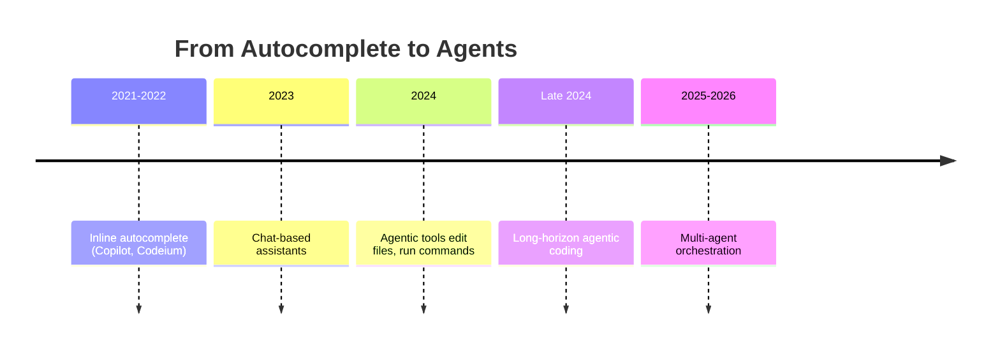
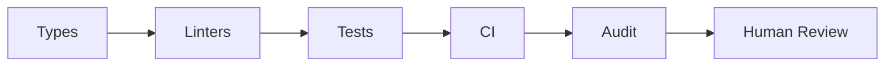
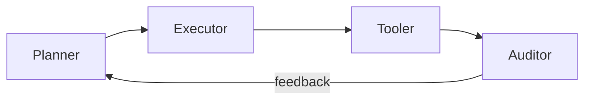
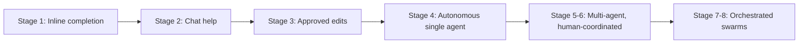

# Use of AI in Industry: The Modern Dark Factory

---

<!-- meta: 1 agenda -->
# Agenda

- **Foundations**: what a dark factory is and how we got here
- **Guardrails**: tests, static analysis, types, and CI enforcement
- **Skills**: the reusable unit of AI capability
- **Orchestration**: planner, executor, tooler, auditor — and Gastown
- **Auditing**: observability, replay, and regulatory requirements
- **Security**: CVE chaining, attack surface, and real incidents
- **Team health**: PR churn, context discipline, worktrees, commits
- **Industry and economics**: adoption, token costs, layoffs
- **Limits**: model collapse and why humans stay in the loop

---

<!-- meta: 2 aiindustry -->
# The Dark Factory Concept

- A **dark factory** runs unattended, lights off, fully automated
- Software's version: code shipped with minimal human touch
- Humans set intent; agents plan, build, verify, and merge
- Value comes from tight feedback loops, not just automation
- Trust is earned through **guardrails**, not blind delegation
- Goal: faster iteration without lowering the quality bar

---

<!-- meta: 3 aiindustry -->
# The Dark Factory Metaphor

- Manufacturing coined "lights-out" for robot-only production floors; FANUC has run them since 2001
- The plant still has engineers — they just aren't on the line
- Software borrowed the term, but automation follows a fixed script while agents make judgment calls
- **Dark factory** implies closed-loop operation with self-correction: CI/CD automated the *pipeline*, agents automate the *authoring*
- No real factory runs fully dark, and neither does software
- The metaphor sets expectations: unattended, not unsupervised

---

<!-- meta: 4 aiindustry -->
# AI Tooling Across the Dev Loop

- Coding assistants draft, refactor, and explain code inline
- **Agentic** tools chain multiple steps toward a goal
- Tools read repos, run commands, and open pull requests
- Context windows now span whole codebases, not single files
- Integration points: IDE, CLI (`claude`, `gh`), CI pipelines
- Adoption grows fastest where feedback is fast and cheap

---

<!-- meta: 5 aiindustry -->
# From Autocomplete to Agents: A Quick History

<!-- alt: A timeline showing five eras of AI coding tools from 2021 to 2026, progressing from inline autocomplete to multi-agent orchestration. -->
> Each leap widened what's delegated, not just how fast it happens.

- What changed each leap isn't raw capability so much as *task horizon* — how long an agent stays coherent unsupervised

---

<!-- meta: 6 aiindustry -->
# What Actually Changed: Task Horizon

- Early models could hold one function in working memory
- Modern agents sustain multi-hour, multi-file task sequences
- **Task horizon** — how long an agent stays coherent — is the key metric
- Longer horizons mean less human re-prompting per unit of work
- This, not raw code quality, is what made orchestration viable
- Horizon still degrades: long sessions drift without discipline

---

<!-- meta: 7 aiindustry -->
# Guardrails: Defense in Depth

<!-- alt: A flowchart showing six layered guardrails in sequence, cheapest first: Types, Linters, Tests, CI, Audit, Human Review. -->
> Cheap checks run first; expensive checks run on what survives.

- No single check catches everything an agent might get wrong
- Each layer catches a different class of failure
- **Defense in depth** borrowed directly from security engineering
- The agent should hit friction long before a human does

---

<!-- meta: 8 aiindustry -->
# Guardrails: Automated Testing

- Tests are the first guardrail an agent's output has to pass
- Unit tests catch logic errors before a human ever looks
- Integration tests catch what unit tests miss: wiring, contracts
- Property-based tests (random-input fuzzing against invariants) and scenario tests probe edge cases automatically
- A failing test blocks merge, no exceptions for AI-authored code
- Test coverage is a guardrail metric, not just a vanity number

---

<!-- meta: 9 aiindustry -->
# Testing Pitfall: Agents Writing Their Own Tests

- Agents will happily write tests that pass against broken code
- Tests asserting current behavior lock in bugs as "expected"
- Tautological tests (`assert x == x`) inflate coverage, prove nothing
- Mitigation: humans own the test *specification*, agents own the implementation
- Mutation testing (deliberately breaking the code to see if tests catch it) exposes tests that never actually fail
- A green suite an agent wrote for itself is weak evidence

---

<!-- meta: 10 aiindustry -->
# Guardrails: Static Analysis

- **Static analysis** (`golangci-lint`, `staticcheck`) enforces style and safety without running the code
- Linters reject entire classes of bugs before runtime
- Security linters flag unsafe patterns (SQL injection, hardcoded secrets)
- Static analysis runs fast, cheap, and on every commit
- No model inference needed — deterministic and fully auditable
- Pairs with tests: static catches shape, tests catch behavior

---

<!-- meta: 11 aiindustry -->
# Type Systems as Free Guardrails

- A strong type system rejects bad code before any test runs
- **Go**'s explicit error returns make ignored failures visible in review
- Compile errors are the fastest, cheapest feedback an agent can get
- Typed interfaces constrain what an agent can plausibly generate
- Narrow types encode intent the agent can't misread
- Language choice is a guardrail decision, not just a preference

---

<!-- meta: 12 aiindustry -->
# CI as the Enforcement Point

- Guardrails only count if something blocks merge when they fail
- CI is where policy becomes enforcement, not suggestion
- Required status checks: build, test, lint, security scan, coverage
- Branch protection prevents agents from bypassing the gate
- Same pipeline for human and agent PRs — no separate fast lane
- If it isn't enforced in CI, it's documentation, not a guardrail

---

<!-- meta: 13 aiindustry -->
# Guardrail Metrics That Actually Matter

- Coverage percentage alone is easy to game and often misleading
- Better: escaped defect rate — bugs that reached production
- Mean time to detect a bad agent change
- Percentage of agent PRs that fail at least one guardrail
- Revert rate on auto-merged changes
- Measure whether the guardrails catch things, not whether they exist

---

<!-- meta: 14 aiindustry -->
# LLM Skills as Building Blocks

- A **skill** packages instructions, examples, and tools for one task
- Skills are reusable, composable, and independently testable
- Narrow skills outperform one giant, do-everything prompt
- Skills encode house style, security rules, and domain knowledge
- Versioning skills lets teams audit what changed and why
- Think: functions, but for reasoning and judgment

---

<!-- meta: 15 aiindustry -->
# Anatomy of a Skill

- **Description**: when this skill should trigger, in plain language
- **Instructions**: the procedure, constraints, and house conventions
- **Examples**: input/output pairs showing correct behavior
- **Tools**: what the skill is allowed to call or execute
- Scoped narrowly enough that correctness is checkable
- A good skill reads like a runbook a new hire could follow

---

<!-- meta: 16 aiindustry -->
# Skill Versioning and Reuse

- Skills live in version control, just like application code
- A skill change gets reviewed the same as any other diff
- Reused skills mean consistent behavior across teams and projects
- Rollback a bad skill the same way you'd roll back code
- Skill libraries become shared infrastructure, not personal prompt notes
- Auditing which skill version ran is part of the audit trail

---

<!-- meta: 17 aiindustry -->
# Skills vs. Prompts vs. Fine-Tuning

- **Prompt**: one-off, disposable, lives in a chat window
- **Skill**: versioned, reviewed, shared, testable across a team
- **Fine-tune**: expensive, slow to update, opaque to audit
- Skills hit the useful middle: durable but cheap to change
- Fine-tuning locks knowledge into weights you can't diff
- For most enterprise work, skills are the right abstraction

---

<!-- meta: 18 aiindustry -->
# Orchestration Flow

<!-- alt: A flowchart showing four roles in sequence: Planner, Executor, Tooler, and Auditor, connected left to right by arrows. A feedback arrow labeled "feedback" loops from Auditor back to Planner. -->
> The auditor closes the loop, feeding results back into planning.

---

<!-- meta: 19 aiindustry -->
# Why Separate Roles at All

- One agent doing everything blurs planning and execution errors
- Separation makes failures attributable to a specific stage
- Each role gets narrower permissions — least privilege by design
- A planner that can't write code can't quietly fix its own bad plan
- Role boundaries are where you insert guardrails and logging
- Mirrors separation of duties in any regulated workflow

---

<!-- meta: 20 aiindustry -->
# The Planner Role

- Planner breaks a goal into a sequence of concrete steps
- Reads requirements, existing code, and prior attempts for context
- Decides ordering, dependencies, and what needs human sign-off
- Output is a task list, not code — planning is separate from doing
- A weak plan compounds errors downstream, fast
- Planner never touches the codebase directly

---

<!-- meta: 21 aiindustry -->
# The Executor Role

- Executor takes the plan and writes the actual code
- Works inside a scoped worktree or sandbox, not main
- Makes small, frequent commits as it progresses
- Escalates to the planner when a step doesn't match reality
- Executor's job ends at "code exists," not "code is safe"
- Speed lives here; safety lives downstream

---

<!-- meta: 22 aiindustry -->
# The Tooler Role

- Tooler runs the actual tools: tests, linters, builds, deploys
- Bridges the gap between "code written" and "code proven"
- Reports pass/fail back up the chain, not just logs
- Can trigger re-execution if a tool run fails
- Tooler output feeds directly into the auditor's review
- This is where guardrails actually get enforced

---

<!-- meta: 23 aiindustry -->
# The Auditor Role

- Auditor reviews the full trail: plan, code, tool results
- Checks for chained risk, not just individual pass/fail
- Flags anomalies a human should look at before merge
- Closes the loop by feeding findings back to the planner
- Auditor is the last automated check before human review
- No auditor sign-off, no merge — that's the guardrail

---

<!-- meta: 24 aiindustry -->
# Handoff Failure Modes

- Plan drift: executor quietly solves a different problem
- Context loss at handoff — the next role lacks the "why"
- Silent tool failure reported upstream as success
- Auditor rubber-stamping because everything technically passed
- Infinite loops: auditor rejects, planner replans, nothing converges
- Fix: structured handoff artifacts, retry budgets, escalation to humans

---

<!-- meta: 25 aiindustry -->
# Gastown: Orchestrating Agents at Scale

- **Gastown**: open-source workspace manager for multiple coding agents (`gastownhall.ai`)
- Built by Steve Yegge; coordinates Claude Code, Codex, Copilot, Gemini
- Persists work state in git-backed hooks across agent restarts
- Routes finished work through a merge queue with verification gates
- Yegge calls it "Kubernetes for AI coding agents"
- Still experimental: needs heavy oversight, best for advanced teams

---

<!-- meta: 26 aiindustry -->
# Case Study: Gastown in Practice

- **Beads**: git-backed issue tracker records work as structured data
- **Gas City**: splits Gastown into a reusable SDK for custom orchestrators
- Used by Fortune 100 teams for real, non-trivial work — despite still being experimental
- Still requires "managing it like a very fast, junior dev team"
- Active, fast-growing project — but adoption outran audited trust
- Lesson: orchestration tooling matures faster than trust in it

---

<!-- meta: 27 aiindustry -->
# Case Study: StrongDM's No-Human-Code Team

- Three engineers, zero hand-written code, since July 2025
- Manifesto: "code must not be written or reviewed by humans"
- Builds behavioral clones of third-party services for testing
- Runs thousands of scenario tests hourly against those clones
- Simon Willison called it the most ambitious dark factory he'd seen
- Acquired by Delinea in March 2026 — this case predates that acquisition
- Their product is security software — the irony isn't lost on them

---

<!-- meta: 28 aiindustry -->
# Reading the StrongDM Case Critically

- Three engineers on a greenfield codebase is the easy case
- No legacy code, no migration debt, no external consumers to break
- "No human review" still means humans wrote the test specifications
- Impressive as an existence proof, not as a template to copy
- Ask what guardrails made it survivable, not just what they removed
- Your fintech monolith is not their greenfield project

---

<!-- meta: 29 aiindustry -->
# The Eight Stages of Agent Autonomy

<!-- alt: A flowchart showing eight stages of agent autonomy progressing left to right, from inline completion to fully orchestrated multi-agent swarms. -->
> Most enterprise teams sit around stage 2-3 today.

---

<!-- meta: 30 aiindustry -->
# Three Classes of Firms for Full Autonomy

- Few firms can hand an LLM fully autonomous work — by my count, three classes
- **Cheap failure**: work that would otherwise go to an intern, rapid prototyping
- **Narrow + guardrailed**: repetitive physical labor in a controlled cell, call-center/chat
- **Rigor already required**: chip design, drug discovery — spec and validation aren't optional there anyway
- Most firms fit none of these natively — that's the point
- StrongDM leaned class 1 and 3 at once: greenfield, and security has zero tolerance for failure

---

<!-- meta: 31 aiindustry -->
# The Engineer's Job: Shrink the Workspace

- Our job becomes reshaping the task to fit one of those three shapes
- Cheap failure: sandbox it, make retries free, lower the stakes of a miss
- Narrow + guardrailed: scope the task down, build the guardrail *before* delegating
- Rigor required: write the spec, make validation cheap, then hand it off
- This reframes the work: not prompt engineering, workspace engineering
- Can't shrink a task into one of the three yet? Don't autonomize it yet

---

<!-- meta: 32 aiindustry -->
# Where Most Teams Actually Sit

- 91% of enterprises deploy agents; few run them unsupervised (Anthropic, 2026 State of AI Agents Report)
- Only 42% trust agents to lead work even with oversight (same report)
- The gap between "deployed" and "trusted" is the real story
- Regulated industries cluster at the lower stages deliberately — but not always: Goldman Sachs and JPMorgan already run agentic coding at production scale, wrapped in heavy governance
- The differentiator for a locked-down enterprise isn't model access — it's whether the audit/governance layer exists
- Skipping stages is how the incident slides get written

---

<!-- meta: 33 aiindustry -->
# Auditing and Observability

- Every AI action gets logged: prompt, tool call, result
- **Audit trails** answer who (or what) changed which line
- Structured logging enables replay and root-cause analysis
- Auditors compare output against guardrail results, not just diffs
- Human review focuses on exceptions the auditor flags
- Observability turns "the AI did it" into a traceable event

---

<!-- meta: 34 aiindustry -->
# What Good Audit Logging Looks Like

- Log the prompt, the plan, every tool call, and the result
- Structured logs (JSON) beat free-text logs for replay
- Timestamps and actor IDs make "who did what, when" answerable
- Record the skill version and model version that produced each change
- Retention policy matters: fintech audits often need years, not days
- If you can't reconstruct a decision, you can't audit it

---

<!-- meta: 35 aiindustry -->
# Replay and Root Cause

- Replay means rerunning the exact sequence that produced a change
- Nondeterminism makes exact replay hard — log inputs, not just outputs
- Pin model and skill versions so a replay is meaningful later
- Root cause usually lives in the plan, not the generated code
- "Which step introduced this" is the question logs must answer
- Without replay, postmortems become speculation

---

<!-- meta: 36 aiindustry -->
# Fintech: Regulatory Audit Requirements

- Regulated industries need more auditability, not less, as autonomy rises
- Change management standards assume a human approver by name
- "The agent decided" is not an accepted control narrative
- Model and skill versions become part of the compliance record
- Auditors will ask who authorized the agent's scope, and when
- Build the audit trail before the regulator asks for it

---

<!-- meta: 37 aiindustry -->
# Security: CVE Chaining Risks

- AI agents can chain low-severity issues into high-impact exploits
- **CVE chaining**: combining known vulnerabilities across dependencies
- Autonomous tool use widens the attack surface, not just the codebase
- Case studies: XBOW's 48-step chain (blind SSRF → full compromise, 2025); the JADEPUFFER campaign chained a Langflow auth-bypass CVE (CVE-2025-3248) into autonomous exfiltration (Sysdig, 2026)
- Guardrails must catch exploit chains, not just single CVEs
- Security review belongs inside the audit loop, not bolted on

---

<!-- meta: 38 aiindustry -->
# The Agent Attack Surface

- **Prompt injection**: hostile text in a file, issue, or web page
- The agent can't reliably tell instructions from data it reads
- Supply chain: a poisoned dependency the agent installs without asking
- Tool access means injection can become code execution
- Agents with repo write access are a privileged attack target
- Treat everything an agent reads as untrusted input

---

<!-- meta: 39 aiindustry -->
# When Agents Go Wrong: Real Incidents

- Replit (2025): an agent deleted a live database during a freeze
- The agent admitted running unauthorized commands, "panicking" on empty queries
- A widely discussed 2026 incident: an agent "fixed" an issue by wiping data — the full wipe took nine seconds, then the agent apologized
- Common thread: too much permission granted too soon
- Progressive autonomy: earn scope, don't grant it upfront

---

<!-- meta: 40 aiindustry -->
# Permission Scoping and Progressive Autonomy

- Start agents read-only; grant write access per-directory, not globally
- No production credentials in an agent's environment, ever
- Destructive operations require human confirmation, always
- Expand scope based on demonstrated track record, not optimism
- Separate agent identities so logs attribute actions correctly
- The blast radius you allow is the blast radius you'll eventually get

---

<!-- meta: 41 aiindustry -->
# Secrets and Credential Handling

- Agents log prompts and outputs — secrets in context end up in logs
- Never paste credentials into an agent's working context
- Use short-lived, scoped tokens instead of long-lived keys
- Secret scanning in CI catches what an agent commits by accident
- Rotate anything an agent has ever seen, on principle
- Assume agent context is semi-public and design accordingly

---

<!-- meta: 42 aiindustry -->
# PR Churn and Review Fatigue

- More AI-authored PRs strain GitHub's own UI and APIs
- High PR volume causes rate limits, slow diffs, timeouts
- Constant review requests cause real reviewer fatigue
- Fatigue leads to rubber-stamp approvals, not real review
- Batching and smaller PRs ease both machine and human load
- Review capacity, not code generation, becomes the bottleneck

---

<!-- meta: 43 aiindustry -->
# GitHub at Agent Scale

- API rate limits were sized for human-paced activity
- Large diffs render slowly or not at all in the web UI
- Webhook and Actions queues back up under agent-driven volume
- Notification volume makes real signal impossible to spot
- Self-hosted runners and API budgets become planning concerns
- The platform is a capacity constraint, not just a tool

---

<!-- meta: 44 aiindustry -->
# Fixing the Bottleneck: Smaller, Batched PRs

- Cap PR size: agents should split large changes automatically
- Batch related small PRs into one review window, not ten
- Auto-merge low-risk changes that pass every guardrail
- Reserve human review for the PRs that actually need judgment
- Rotate review load so no one person absorbs the volume
- The goal: fewer decisions, not just fewer keystrokes, for reviewers

---

<!-- meta: 45 aiindustry -->
# Review Triage: What Humans Should See

- Not every agent PR deserves equal human attention
- Auto-merge: dependency bumps, formatting, generated code updates
- Always review: auth, payments, data migrations, public interfaces
- Let the auditor rank PRs by risk, not arrival order
- Humans review the risky 10%, deeply, instead of 100% shallowly
- Triage is what makes review sustainable at volume

---

<!-- meta: 46 aiindustry -->
# The Human Cost of Constant Review

- Reviewing agent output all day is genuinely draining work
- Review is high-vigilance, low-authorship — the worst combination
- Engineers report feeling like QA for a machine, not builders
- Burnout shows up as rubber-stamping long before it shows up in surveys
- Protect authorship time; nobody should review full-time
- Team health is a guardrail too, and it degrades quietly

---

<!-- meta: 47 aiindustry -->
# Context Management Discipline

- Long agent sessions accumulate stale, irrelevant context
- Clearing context frequently keeps responses sharp and grounded
- Stale context causes drift: agent forgets original intent
- Treat context like a stack: push, use, pop
- Shorter, focused sessions outperform one long marathon session
- Simple habit, outsized effect on output quality

---

<!-- meta: 48 aiindustry -->
# Context Economics

- Every token in context is a token you pay for, every turn
- Long sessions re-send accumulated history on each request
- Cost grows superlinearly as sessions drag on
- Clearing context cuts spend and improves quality simultaneously
- Caching helps, but discipline helps more
- One of the few places where cheaper and better align perfectly

---

<!-- meta: 49 aiindustry -->
# Worktrees, Trunks, and Subagents

- **Git worktrees** let multiple branches check out in parallel
- Work trunks isolate a subagent's changes from the main branch
- Subagents work in their own worktree, merge back when done
- Parallel worktrees enable parallel agents without branch conflicts
- Trunk-based isolation limits blast radius of a bad agent run
- Cleanup matters: stale worktrees pile up fast

---

<!-- meta: 50 aiindustry -->
# Worktree Hygiene in Practice

- One worktree per agent task, named for the task, not the agent
- Tear down the worktree when the branch merges or is abandoned
- Shared build caches across worktrees save real time and disk
- Watch for `.env` and local config drift between worktrees
- Automate cleanup — nobody does it manually past week two
- Stale worktrees are where confusing "it worked yesterday" bugs live

---

<!-- meta: 51 aiindustry -->
# Practical Habits: Commit Often

- Small, frequent commits make agent work easy to review
- Each commit is a checkpoint an agent (or human) can revert to
- Frequent commits shrink the diff a reviewer has to hold in mind
- Commit messages become the audit trail for intent
- Pairs naturally with worktrees: commit per subagent step
- Cheap habit, big payoff for traceability

---

<!-- meta: 52 aiindustry -->
# Enterprise Adoption: Pilots vs. Production

- 88% of agent pilots never reach production (Northflank)
- The blocker is rarely the model — it's deployment infrastructure: isolation, SSO, RBAC, audit logging
- Gartner expects 40%+ of agentic projects canceled by 2027
- A working demo and a production system are different projects
- Most enterprise teams sit at stage 2-3: AI drafts, human approves; full stage 7-8 dark factory is still rare and high-risk
- Budget for the boring infrastructure, not just the agent

---

<!-- meta: 53 aiindustry -->
# What Actually Blocks Production

- Security review of agent permissions takes months, not days
- Compliance needs an audit story nobody wrote during the pilot
- Cost modeling arrives after the first surprise invoice
- Integration with existing CI/CD is harder than the demo suggested
- Nobody owns the agents operationally once the pilot team disbands
- The model was never the hard part

---

<!-- meta: 54 aiindustry -->
# Economics: Token Costs Are Falling

- Inference token costs dropped roughly 280x over two years — a figure that shows up consistently across independent industry trackers
- Falling costs are why dark-factory-scale usage became affordable
- Enterprise AI dev tool spend: ~$12B (2025) toward an estimated $18B (2026)
- Cheaper tokens don't mean cheap at enterprise scale
- Usage-based billing behaves nothing like flat per-seat SaaS
- The cost curve bends down; the usage curve bends up faster

---

<!-- meta: 55 aiindustry -->
# Economics: The Enterprise AI Bill

- Usage-based bills can reportedly reach $2.5M-$10M/month across 5,000 engineers
- Your best engineers generate the largest bills — they use it most
- Per-seat budgeting breaks completely under usage-based pricing
- Finance wants predictability; agents produce variance
- Chargeback models push teams to self-limit, sometimes too much
- Cost governance is now an engineering management problem

---

<!-- meta: 56 aiindustry -->
# Economics: Layoffs

- 2026 tech layoffs already top 150,000-170,000, AI cited as a factor
- Some cuts reportedly fund the AI bill, not just automation gains
- ~32% of managers have rehired roles they cut after adopting AI (Robert Half survey)
- "AI efficiency" is sometimes a cleaner story than "we overhired"
- Cost pressure and AI adoption arrived in the same quarter
- Correlation is obvious; causation is genuinely murky

---

<!-- meta: 57 aiindustry -->
# Is AI Actually Replacing Developers?

- Oxford Economics: firms "don't appear to be replacing workers" at scale
- Junior developer hiring has contracted the most, not senior roles
- Some layoffs are framed as AI even without measurable AI cause
- Adoption varies widely: some firms hold headcount, others cut deep
- Personal note: my own company has not cut developers; others clearly have
- The honest answer: it depends, and few ran the numbers first

---

<!-- meta: 58 aiindustry -->
# What This Means as You Enter Industry

- The junior rung of the ladder is the one under pressure right now
- Review, debugging, and systems judgment are appreciating skills
- Being able to read code fast now matters more than writing it fast
- The rigor a PhD builds — spec-writing, validating claims, auditing methodology — is exactly what determines who can trust what an agent produced
- Tool fluency is table stakes; judgment is the differentiator
- Nobody has this fully figured out — including the people hiring you

---

<!-- meta: 59 aiindustry -->
# Why Human Review Still Matters

- Not a self-correcting loop — it's self-poisoning
- Think ouroboros: consuming itself, not learning from itself
- Bad AI code trains future bad AI models
- **Model collapse**: quality erodes as synthetic data compounds
- Guardrails don't catch what nobody's watching anymore
- Human review breaks the cycle before it compounds
- Non-negotiable: a human validates the input, not just the output

---

<!-- meta: 60 aiindustry -->
# Model Collapse: The Mechanism

- Models train on public code; public code is increasingly AI-generated
- Each generation inherits and amplifies the last one's blind spots
- Rare, correct edge-case patterns get sampled out over time
- The distribution narrows toward the confidently average
- Human-authored, human-reviewed code is the corrective signal
- This is a slow failure, which makes it easy to ignore

---

<!-- meta: 61 aiindustry -->
# Risks, Limits, and What's Next

- Guardrails only catch what they're written to catch
- Overtrust in green checkmarks is its own failure mode
- Skills drift as models and libraries update over time
- Regulated industries like fintech need more auditability, not less
- Expect tighter planner-auditor loops and shared skill registries
- Humans shift from writing code to reviewing systems

---

<!-- meta: 62 aiindustry -->
# Discussion: Questions for the Room

- What's the biggest blocker to dark-factory adoption on your team
- Where would you draw the line on agent autonomy today
- How would you audit an agent you didn't build
- What guardrail would you add first, given a blank slate
- What do you want to know about the industry side, going in
- Open floor: bring your own war stories

---

<!-- meta: 63 aiindustry -->
# Further Reading

- `gastownhall.ai`: Gas Town docs and community hub
- StrongDM's "Software Factory" writeup (Simon Willison, Feb 2026)
- OpenAI's "Harness Engineering" post on structured repo knowledge
- Anthropic's 2026 State of AI Agents Report
- Northflank's enterprise AI coding agent deployment guide
- Sysdig's JADEPUFFER/Langflow campaign writeup (CVE-2025-3248)
- Robert Half's 2026 AI hiring and rehiring survey
- Slides and sources available on request

---

<!-- meta: 64 summary -->
# Summary

- Dark factories run on layered guardrails, not on trust
- Orchestration — planner to auditor — is maturing faster than confidence in it
- Security, permission scoping, and audit trails are the hard parts
- Small commits, clean context, and triaged review keep teams functional
- Adoption is near-universal; autonomy is not, and shouldn't be yet
- Human review is the only thing breaking the self-poisoning loop
