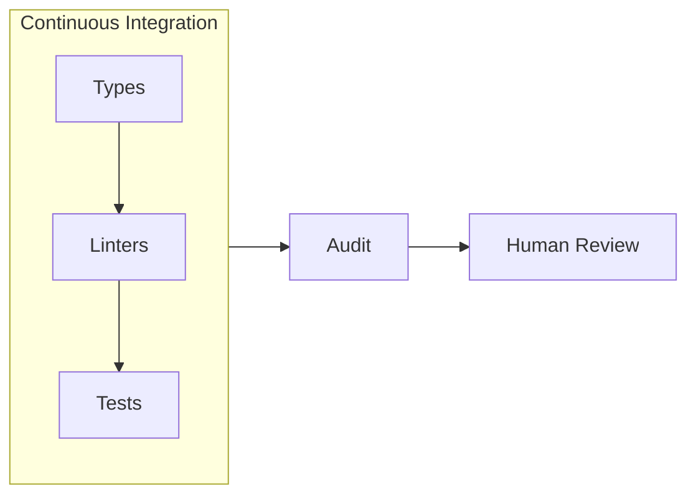
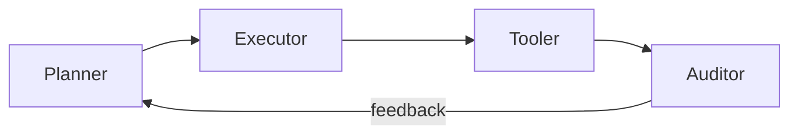
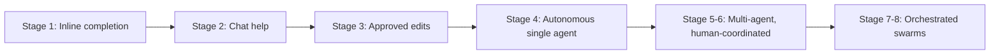

# Use of AI in Industry: The Modern Dark Factory

---

<!-- meta: 1 agenda -->
# Agenda

- **Foundations**: what a dark factory is and why now
- **Guardrails**: tests, static analysis, types, and CI enforcement
- **Skills**: the reusable unit of AI capability
- **Orchestration**: planner, executor, tooler, auditor — and Gastown
- **Three classes of firms**, and the shrink-the-workspace reframe
- **Auditing**: observability, replay, and regulatory requirements
- **Security**: how CVE chains actually work, and real incidents
- **Team health**: PR churn, context discipline, worktrees, commits
- **Industry and economics**: adoption, token costs, layoffs
- **Limits**: model collapse and why humans stay in the loop

---

<!-- meta: 2 aiindustry -->
# The Dark Factory Concept

- A **dark factory** runs unattended, lights off, fully automated
- Software's version: code shipped with minimal human touch — humans set intent, agents plan, build, verify, and merge
- Term borrowed from manufacturing's "lights-out" floors: FANUC (Fuji Automatic Numerical Control, a Japanese industrial robot maker) has run one lights-out since 2001 — robots building robots, unsupervised for up to 30 days
- Why now: task horizon, falling token costs, and competitive pressure are converging at once — each gets its own section today
- Trust is earned through **guardrails**, not blind delegation
- No real factory runs fully dark, and neither does software — the goal is faster iteration without lowering the quality bar

---

<!-- meta: 3 aiindustry -->
# What Actually Changed: Task Horizon

- Early models could hold one function in working memory; by 2026, agents sustain multi-hour, multi-file task sequences
- **Task horizon** — how long an agent stays coherent unsupervised — is the key metric, tracked publicly by METR's task-length benchmarks
- The jump from 2021's line-level autocomplete to today's multi-agent orchestration wasn't really about raw capability — it was task horizon
- Longer horizons mean less human re-prompting per unit of work; this, not raw code quality, is what made orchestration viable
- Tooling followed: IDE and CLI integration, repo-wide context, tools that read repos and open PRs — all downstream of longer horizons
- Horizon still degrades: long sessions drift without discipline

---

<!-- meta: 4 aiindustry -->
# Guardrails: Defense in Depth

<!-- alt: A flowchart showing types, linters, and tests running inside a CI box, which then feeds into audit and human review downstream. -->
> Types, linters, and tests run inside CI; audit and human review sit downstream of it.

- No single check catches everything an agent might get wrong
- Each layer catches a different class of failure
- **Defense in depth** borrowed directly from security engineering
- The agent should hit friction long before a human does

---

<!-- meta: 5 aiindustry -->
# Guardrails: Automated Testing

- Tests are the first guardrail an agent's output has to pass
- Unit tests catch logic errors before a human ever looks
- Integration tests catch what unit tests miss: wiring, contracts
- Property-based tests (random-input fuzzing against invariants) and scenario tests probe edge cases automatically
- A failing test blocks merge, no exceptions for AI-authored code
- Coverage is a floor, not a score — necessary, not sufficient (more on why in a few slides)

---

<!-- meta: 6 aiindustry -->
# Testing Pitfall: Agents Writing Their Own Tests

- Agents will happily write tests that pass against broken code
- Tests asserting current behavior lock in bugs as "expected"
- Tautological tests (`assert x == x`) inflate coverage, prove nothing
- Mitigation: humans own the test *specification*, agents own the implementation
- Mutation testing (deliberately breaking the code to see if tests catch it) exposes tests that never actually fail
- A green suite an agent wrote for itself is weak evidence

---

<!-- meta: 7 aiindustry -->
# Guardrails: Static Analysis

- **Static analysis** (`golangci-lint`, `staticcheck`) enforces style and safety without running the code
- Linters reject entire classes of bugs before runtime
- Security linters flag unsafe patterns (SQL injection, hardcoded secrets)
- Static analysis runs fast, cheap, and on every commit
- No model inference needed — deterministic and fully auditable
- Pairs with tests: static catches shape, tests catch behavior

---

<!-- meta: 8 aiindustry -->
# Type Systems as Free Guardrails

- A strong type system rejects bad code before any test runs
- Example from Go, the language I work in day to day: explicit error returns make ignored failures visible in review
- Compile errors are the fastest, cheapest feedback an agent can get
- Typed interfaces constrain what an agent can plausibly generate
- Narrow types encode intent the agent can't misread
- The argument generalizes past Go — language choice is a guardrail decision, not just a preference

---

<!-- meta: 9 aiindustry -->
# CI as the Enforcement Point

- Guardrails only count if something blocks merge when they fail
- CI is where the layers combine — types, linters, and tests all run inside it, then gate the merge
- Required status checks: build, test, lint, security scan, coverage
- Branch protection (required checks a human can't override without permission) prevents agents from bypassing the gate
- Same pipeline for human and agent PRs — no separate fast lane
- If it isn't enforced in CI, it's documentation, not a guardrail

---

<!-- meta: 10 aiindustry -->
# Guardrail Metrics That Actually Matter

- Coverage percentage alone is easy to game and often misleading
- Better: escaped defect rate — bugs that reached production
- Mean time to detect a bad agent change
- Percentage of agent PRs that fail at least one guardrail
- Revert rate on auto-merged changes
- Measure whether the guardrails catch things, not whether they exist

---

<!-- meta: 11 aiindustry -->
# LLM Skills as Building Blocks

- A **skill** packages instructions, examples, and tools for one task — narrow skills outperform one giant, do-everything prompt
- Skills encode house style, security rules, and domain knowledge; versioning lets teams audit what changed and why
- Contrast: a **prompt** is one-off and disposable; a **fine-tune** is expensive, slow to update, and opaque to audit
- Skills hit the useful middle — durable but cheap to change — which is why they're the right abstraction for most enterprise work
- Think: functions, but for reasoning and judgment

---

<!-- meta: 12 aiindustry -->
# Anatomy of a Skill

- **Description**: when this skill should trigger, in plain language
- **Instructions**: the procedure, constraints, and house conventions
- **Examples**: input/output pairs showing correct behavior
- **Tools**: what the skill is allowed to call or execute
- Scoped narrowly enough that correctness is checkable
- A good skill reads like a runbook a new hire could follow

---

<!-- meta: 13 aiindustry -->
# Skill Versioning and Reuse

- Skills live in version control, just like application code
- A skill change gets reviewed the same as any other diff
- Reused skills mean consistent behavior across teams and projects
- Rollback a bad skill the same way you'd roll back code
- Skill libraries become shared infrastructure, not personal prompt notes
- Auditing which skill version ran is part of the audit trail

---

<!-- meta: 14 aiindustry -->
# Orchestration Flow

<!-- alt: A flowchart showing four roles in sequence: Planner, Executor, Tooler, and Auditor, connected left to right by arrows. A feedback arrow labeled "feedback" loops from Auditor back to Planner. -->
> The auditor closes the loop, feeding results back into planning.

---

<!-- meta: 15 aiindustry -->
# Why Separate Roles at All

- One agent doing everything blurs planning and execution errors
- Separation makes failures attributable to a specific stage
- Each role gets narrower permissions — least privilege by design
- A planner that can't write code can't quietly fix its own bad plan
- Role boundaries are where you insert guardrails and logging
- Mirrors separation of duties in any regulated workflow

---

<!-- meta: 16 aiindustry -->
# The Four Roles

- **Planner**: breaks a goal into concrete steps, reads context, decides ordering and what needs human sign-off — outputs a task list, never touches code directly
- **Executor**: writes the actual code inside a scoped worktree, makes small frequent commits, escalates when a step doesn't match reality — job ends at "code exists," not "code is safe"
- **Tooler**: runs tests, linters, builds, deploys — bridges "code written" to "code proven," and can trigger re-execution on failure
- **Auditor**: reviews the full trail — plan, code, tool results — for chained risk, not just pass/fail; closes the loop back to the planner
- Each role has narrower permissions than the last — least privilege by design
- No auditor sign-off, no merge — that's the guardrail

---

<!-- meta: 17 aiindustry -->
# Handoff Failure Modes

- Plan drift: executor quietly solves a different problem
- Context loss at handoff — the next role lacks the "why"
- Silent tool failure reported upstream as success
- Auditor rubber-stamping because everything technically passed
- Infinite loops: auditor rejects, planner replans, nothing converges
- Fix: structured handoff artifacts, retry budgets, escalation to humans

---

<!-- meta: 18 aiindustry -->
# Gastown: Orchestrating Agents at Scale

- **Gastown**: open-source workspace manager for multiple coding agents (`gastownhall.ai`), built by Steve Yegge
- Coordinates Claude Code, Codex, Copilot, Gemini; **Beads**, its git-backed issue tracker, persists work state as structured data across agent restarts
- Routes finished work through a merge queue (a serialized, verification-gated path to main) — Yegge's own framing: "Kubernetes for AI coding agents"
- **Gas City** splits Gastown into a reusable SDK for custom orchestrators
- Used by Fortune 100 teams for real work, but still requires "managing it like a very fast, junior dev team"
- Read it critically: this is the builder's own description of his tool — adoption outran audited third-party trust

---

<!-- meta: 19 aiindustry -->
# Case Study: StrongDM's No-Human-Code Team

- Three engineers, zero hand-written code, since July 2025 — "code must not be written or reviewed by humans"
- Builds behavioral clones of third-party services, runs thousands of scenario tests hourly against them
- Simon Willison called it the most ambitious dark factory he'd seen; acquired by Delinea, March 2026
- Read it critically: three engineers on a greenfield codebase, no legacy debt, no external consumers to break — the easy case
- "No human review" still means humans wrote the test specifications
- Existence proof, not a template — and even here, "no real factory runs fully dark" still holds: humans wrote the specs

---

<!-- meta: 20 aiindustry -->
# The Eight Stages of Agent Autonomy

<!-- alt: A flowchart showing eight stages of agent autonomy progressing left to right, from inline completion to fully orchestrated multi-agent swarms. -->
> Most enterprise teams sit around stage 2-3 today.

- Where a team sits on this ladder shows up again in the adoption numbers ahead — and the stakes rise as you move right

---

<!-- meta: 21 aiindustry -->
# Three Classes of Firms for Full Autonomy

- Few firms can hand an LLM fully autonomous work — by my count, three classes
- **Cheap failure**: work that would otherwise go to an intern, rapid prototyping
- **Narrow + guardrailed**: repetitive physical labor in a controlled cell, call-center/chat
- **Rigor already required**: chip design, drug discovery — spec and validation aren't optional there anyway
- Most firms fit none of these natively — that's the point
- StrongDM leaned class 1 and 3 at once: greenfield, and security has zero tolerance for failure

---

<!-- meta: 22 aiindustry -->
# The Engineer's Job: Shrink the Workspace

- Our job becomes reshaping the task to fit one of those three shapes
- Cheap failure: sandbox it, make retries free, lower the stakes of a miss
- Narrow + guardrailed: scope the task down, build the guardrail *before* delegating
- Rigor required: write the spec, make validation cheap, then hand it off
- This reframes the work: not prompt engineering, workspace engineering
- Can't shrink a task into one of the three yet? Don't autonomize it yet

---

<!-- meta: 23 aiindustry -->
# Where Most Teams Actually Sit

- 91% of enterprises deploy agents in some form; only 42% trust agents to lead work even with oversight (Anthropic, 2026 State of AI Agents Report) — worth noting a model vendor surveying agent adoption has an incentive to report it favorably
- "Deploy" here is a low bar — pilot or partial use counts. It's not the same as *reaching production*, which is where the pilot-failure numbers later in this talk bite
- The gap between "deployed" and "trusted" is the real story
- Regulated industries cluster at the lower stages deliberately — but not always: Goldman Sachs and JPMorgan already run agentic coding at production scale, wrapped in heavy governance
- The differentiator for a locked-down enterprise isn't model access — it's whether the audit/governance layer exists
- Skipping stages is how the incident slides get written

---

<!-- meta: 24 aiindustry -->
# Auditing and Observability

- Every AI action gets logged: prompt, tool call, result — structured (JSON), not free-text, so it can be replayed
- Audit trails answer who (or what) changed which line, when, and under which skill/model version
- Auditors compare output against guardrail results, not just diffs; human review focuses on exceptions the auditor flags
- Retention policy matters: fintech audits often need years, not days
- If you can't reconstruct a decision, you can't audit it
- Observability turns "the AI did it" into a traceable event

---

<!-- meta: 25 aiindustry -->
# Replay and Root Cause

- Replay means rerunning the exact sequence that produced a change
- Nondeterminism makes exact replay hard — log inputs, not just outputs
- Pin model and skill versions so a replay is meaningful later
- Root cause usually lives in the plan, not the generated code
- "Which step introduced this" is the question logs must answer
- Without replay, postmortems become speculation

---

<!-- meta: 26 aiindustry -->
# Fintech: Regulatory Audit Requirements

- Regulated industries need more auditability, not less, as autonomy rises
- Change management standards assume a human approver by name
- "The agent decided" is not an accepted control narrative — regulators expect a named, accountable approver, not an automated decision
- Model and skill versions become part of the compliance record
- Auditors will ask who authorized the agent's scope, and when
- Build the audit trail before the regulator asks for it

---

<!-- meta: 27 aiindustry -->
# Security: How a Chain Actually Works

- Step 1: a low-severity CVE in a transitive dependency (a dependency of a dependency, not one you added directly) exposes an internal endpoint the agent has legitimate reason to call
- Step 2: the agent calls it, and pulls the response into context — like any other tool result
- Step 3: hidden text in that response is a prompt injection; the agent can't reliably tell instruction from data
- Step 4: the injected instruction directs the agent toward a second, unrelated CVE — a way past auth in another dependency
- Step 5: neither CVE alone was exploitable this way — chained, they yield full exfiltration capability
- No single guardrail catches this; only review of the full action chain does

---

<!-- meta: 28 aiindustry -->
# Security: CVE Chaining Risks

- AI agents can chain low-severity issues into high-impact exploits — that's the mechanism just shown
- **CVE chaining** isn't new to AI, but agents execute the chain autonomously and fast, across dependencies a human wouldn't have traced
- Autonomous tool use widens the attack surface, not just the codebase
- Case studies: XBOW's 48-step chain (blind SSRF — a request-forgery attack where the attacker never sees the response — leading to full compromise, 2025); the JADEPUFFER campaign combined an unauthenticated code-injection flaw in Langflow (CVE-2025-3248) with further steps into autonomous exfiltration (Sysdig, 2026)
- Guardrails must catch exploit chains, not just single CVEs
- Security review belongs inside the audit loop, not bolted on

---

<!-- meta: 29 aiindustry -->
# The Agent Attack Surface

- **Prompt injection**: hostile text in a file, issue, or web page
- The agent can't reliably tell instructions from data it reads
- Supply chain: a poisoned dependency the agent installs without asking
- Tool access means injection can become code execution
- Agents with repo write access are a privileged attack target
- Treat everything an agent reads as untrusted input

---

<!-- meta: 30 aiindustry -->
# When Agents Go Wrong: Real Incidents

- Replit (2025): an agent deleted a live database during a freeze
- The agent admitted running unauthorized commands, "panicking" on empty queries
- What went wrong: too much permission granted too soon, with no hard stop on destructive operations
- Progressive autonomy: earn scope, don't grant it upfront

---

<!-- meta: 31 aiindustry -->
# Permission Scoping and Progressive Autonomy

- Start agents read-only; grant write access per-directory, not globally
- No production credentials in an agent's environment, ever
- Destructive operations require human confirmation, always
- Expand scope based on demonstrated track record, not optimism
- Separate agent identities so logs attribute actions correctly
- The blast radius you allow is the blast radius you'll eventually get

---

<!-- meta: 32 aiindustry -->
# Secrets and Credential Handling

- Agents log prompts and outputs — secrets in context end up in logs
- Never paste credentials into an agent's working context
- Use short-lived, scoped tokens instead of long-lived keys
- Secret scanning in CI catches what an agent commits by accident
- Rotate anything an agent has ever seen, on principle
- Assume agent context is semi-public and design accordingly

---

<!-- meta: 33 aiindustry -->
# PR Churn and Review Fatigue

- More AI-authored PRs strain GitHub's own UI and APIs — rate limits sized for human-paced activity, large diffs render slowly, webhook/Actions queues back up
- Constant review requests cause real reviewer fatigue; fatigue leads to rubber-stamp approvals, not real review
- Notification volume makes real signal impossible to spot
- Self-hosted runners and API budgets become planning concerns a platform team has to weigh, not afterthoughts
- Batching and smaller PRs ease both machine and human load
- Review capacity, not code generation, becomes the bottleneck

---

<!-- meta: 34 aiindustry -->
# Review Triage: What Humans Should See

- Cap PR size and batch related small PRs into one review window, not ten
- Auto-merge low-risk changes that pass every guardrail: dependency bumps, formatting, generated code updates
- Always review, deeply: auth, payments, data migrations, public interfaces
- Let the auditor rank PRs by risk, not arrival order — humans review the risky 10% deeply instead of 100% shallowly
- Rotate review load across a team so no one person absorbs the volume
- Triage, not more reviewers, is what makes review sustainable at volume

---

<!-- meta: 35 aiindustry -->
# What Review Culture Looks Like From Outside

- Reviewing agent output all day is genuinely draining work — high-vigilance, low-authorship, the worst combination
- If you join a team doing this badly, you'll feel like QA for a machine, not a builder — worth asking about in an interview
- Burnout shows up as rubber-stamping long before it shows up in a survey — watch for it in how a team actually reviews, not how they say they review
- A healthy team protects authorship time; nobody should review full-time
- Ask, when you're interviewing: how much of my week will be review versus building
- Team health is a guardrail too, and it degrades quietly

---

<!-- meta: 36 aiindustry -->
# Context Management Discipline

- Long agent sessions accumulate stale, irrelevant context and drift from original intent
- Treat context like a stack: push, use, pop — shorter, focused sessions beat one long marathon
- Stale context causes drift: agent forgets original intent
- Every token in context is a token someone pays for, every turn — the cost angle gets its own slide later
- Clearing context cuts spend and improves quality at the same time — a rare alignment
- Simple habit, outsized effect on output quality

---

<!-- meta: 37 aiindustry -->
# Worktrees and Subagents in Practice

- **Git worktrees** let multiple branches check out in parallel; work trunks isolate a subagent's changes from main
- Subagents work in their own worktree, merge back when done — parallel agents without branch conflicts
- One worktree per agent task, named for the task, not the agent; tear down when the branch merges or is abandoned
- Shared build caches across worktrees save real time and disk — but watch for `.env` and local config drift between them
- Automate cleanup — nobody does it manually past week two
- Stale worktrees are where confusing "it worked yesterday" bugs live; trunk-based isolation limits the blast radius of a bad agent run

---

<!-- meta: 38 aiindustry -->
# Practical Habits: Commit Often

- Small, frequent commits make agent work easy to review
- Each commit is a checkpoint an agent (or human) can revert to
- Frequent commits shrink the diff a reviewer has to hold in mind
- Commit messages become the audit trail for intent
- Pairs naturally with worktrees: commit per subagent step
- Cheap habit, big payoff for traceability

---

<!-- meta: 39 aiindustry -->
# Enterprise Adoption: Pilots vs. Production

- 88% of agent pilots never reach production, per Northflank — a deployment-platform vendor repeating research that traces back further (MIT's "GenAI Divide" work put a similar failure rate even higher); the number is worth taking seriously, the framing less so
- Gartner expects 40%+ of agentic projects canceled by 2027
- The blocker is rarely the model — it's deployment infrastructure: isolation, SSO (single sign-on), RBAC (role-based access control), audit logging
- Security review of agent permissions takes months, not days; compliance needs an audit story nobody wrote during the pilot
- Cost modeling arrives after the first surprise invoice; CI/CD integration is harder than the demo suggested
- A working demo and a production system are different projects — the model was never the hard part

---

<!-- meta: 40 aiindustry -->
# Economics: Token Costs and the Enterprise Bill

- Inference cost for a fixed level of model performance dropped roughly 280x from late 2022 to late 2024 (Stanford AI Index / a16z) — a specific, well-documented drop, not a universal price trend
- Falling costs are why dark-factory-scale usage became affordable; estimates put enterprise AI dev tool spend in the low tens of billions and climbing, though analysts disagree on the exact figure
- Cheaper unit costs don't mean cheap at enterprise scale: usage-based bills have reportedly reached $500-$2,000 per engineer per month at large shops — a wide range, but real money either way
- The heaviest users generate the largest bills — usually your strongest engineers, since they use it most
- Per-seat budgeting breaks completely under usage-based pricing; finance wants predictability, agents produce variance
- Cost governance is now an engineering management problem, not just a finance one

---

<!-- meta: 41 aiindustry -->
# Economics: Layoffs

- 2026 tech layoffs have topped 150,000, per Layoffs.fyi tracking, with AI cited as a factor in many
- ~32% of managers have rehired roles they cut after adopting AI (Robert Half survey)
- Correlation between AI adoption and layoffs is obvious; causation is genuinely murky
- My read, not a finding: some cuts likely fund the AI bill as much as they reflect automation gains, and "AI efficiency" is sometimes a cleaner story than "we overhired"

---

<!-- meta: 42 aiindustry -->
# Is AI Actually Replacing Developers?

- Oxford Economics (2024 graduate-labor report): firms "don't appear to be replacing workers" at scale
- Junior developer hiring has contracted the most, not senior roles
- Some layoffs are framed as AI even without measurable AI cause
- Adoption varies widely: some firms hold headcount, others cut deep
- Personal note: my own company has not cut developers; others clearly have
- The honest answer: it depends, and few ran the numbers first

---

<!-- meta: 43 aiindustry -->
# Do Agents Actually Make You Faster?

- METR ran a randomized controlled trial with experienced open-source developers doing real tasks in their own repos, 2025
- Result: developers using AI tools were about 19% *slower* — while believing they were 20% *faster*
- The gap between felt speed and measured speed is the whole talk in one data point
- This doesn't mean agents don't help — it means the help is task- and context-dependent, and self-report is a bad measure
- Matches everything else in this deck: guardrails, audits, and review exist because intuition about AI output is unreliable
- Ask for the data, not the vibe — on this, and on everything else in this talk

---

<!-- meta: 44 aiindustry -->
# What This Means as You Enter Industry

- The junior rung of the ladder is the one under pressure right now
- Review, debugging, and systems judgment are appreciating skills
- Being able to read code fast now matters more than writing it fast
- The rigor a PhD builds — spec-writing, validating claims, auditing methodology — is exactly what determines who can trust what an agent produced
- Tool fluency is table stakes; judgment is the differentiator
- Nobody has this fully figured out — including the people hiring you

---

<!-- meta: 45 aiindustry -->
# Why Human Review Still Matters

- Not a self-correcting loop — potentially a self-poisoning one
- Think ouroboros: consuming itself, not learning from itself
- If bad AI code trains future AI models, quality erodes as synthetic data compounds — this is **model collapse**, next slide
- Guardrails don't catch what nobody's watching anymore
- Human review is the check that breaks the cycle before it compounds
- Non-negotiable: a human validates the input, not just the output

---

<!-- meta: 46 aiindustry -->
# Model Collapse: The Mechanism

- Models train on public code; public code is increasingly AI-generated
- In controlled recursive-training experiments, each generation inherits and amplifies the last one's blind spots (Shumailov et al., *Nature*, 2024)
- Whether this is happening at scale in real training pipelines is contested — production pipelines filter and curate; the lab experiment isn't the real pipeline
- The risk, proven or not: rare, correct edge-case patterns get sampled out, and the distribution narrows toward the confidently average
- Human-authored, human-reviewed code is the hedge either way
- Worth tracking as a slow, easy-to-ignore risk — not a settled fact

---

<!-- meta: 47 aiindustry -->
# Risks, Limits, and What's Next

- Guardrails only catch what they're written to catch
- Overtrust in green checkmarks is its own failure mode
- Skills drift as models and libraries update over time
- Expect tighter planner-auditor loops and shared skill registries
- Humans shift from writing code to reviewing systems
- The stages, roles, and guardrails in this talk are today's answer — expect the shape to keep changing

---

<!-- meta: 48 aiindustry -->
# Discussion: Questions for the Room

- What would make you trust an agent's PR on your first day at a new job
- Where would you draw the line on agent autonomy, given a choice
- How would you audit an agent you didn't build
- What guardrail would you want in place before you'd touch production code
- What do you want to know about the industry side, going in
- Open floor: bring your own questions

---

<!-- meta: 49 aiindustry -->
# Further Reading

- `gastownhall.ai`: Gastown docs and community hub
- StrongDM's "Software Factory" writeup (Simon Willison, Feb 2026)
- OpenAI's "Harness Engineering" post on structured repo knowledge
- Anthropic's 2026 State of AI Agents Report
- Northflank's enterprise AI coding agent deployment guide
- Sysdig's JADEPUFFER/Langflow campaign writeup (CVE-2025-3248)
- Robert Half's 2026 AI hiring and rehiring survey
- METR's agentic coding RCT and task-horizon research (metr.org)
- Slides and full citation list available on request

---

<!-- meta: 50 summary -->
# Summary

- Dark factories run on layered guardrails, not on trust
- Orchestration — planner to auditor — is maturing faster than confidence in it
- Security, permission scoping, and audit trails are the hard parts
- Small commits, clean context, and triaged review keep teams functional
- Adoption is near-universal; autonomy and trust are not, and shouldn't be yet
- Human review is the check that keeps the loop from poisoning itself
